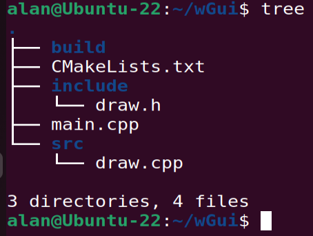
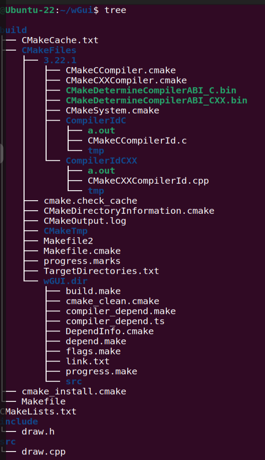

In this article, I am trying to record the procedure when I using cmake to organize a small C++ project named wGUI.

Here is the file structure of the project wGUI:


In the project, there is one source file src/draw.cpp and one header file include/draw.h.

And wGUI uses three libraries: sfml-graphics, sfml-window and sfml-system, which are in SFML graphic library to draw a picture. So we need to install the SFML library first as below:
```
sudo apt-get install sfml-dev
```
This is standard and the easiest way to install SFML graphic library which will put its header files in the exported path.

After that, we can write CMakeLists.txt as following for the wGUI project:
```
# CMakeLists.txt
cmake_minimum_required(VERSION 3.22.1) # cmake最低版本
set(PRJ_NAME wGUI) # 项目名称变量
project(${PRJ_NAME} VERSION 0.0.1) # 项目名称及版本号

find_library(SFML_GRAPHICS sfml-graphics REQUIRED) # 动态库
find_library(SFML_WINDOW sfml-window REQUIRED)
find_library(SFML_SYSTEM sfml-system REQUIRED)

set(LIBS # 动态库
    ${SFML_GRAPHICS}
    ${SFML_WINDOW}
    ${SFML_SYSTEM}
)
add_executable(${PRJ_NAME} src/draw.cpp) # 源文件

target_include_directories(${PRJ_NAME} PUBLIC ${CMAKE_CURRENT_SOURCE_DIR}/include) # 指定头文件目录
target_link_libraries(${PRJ_NAME} PRIVATE ${LIBS}) # 链接库文件
```

As the file structure shows above, we create a ```build``` directory and will do all the building there, so that the intermediate files generated won't influence all the  project files.
```
alan@Ubuntu-22:~/wGui$ cd build
alan@Ubuntu-22:~/wGui/build$ cmake ..
-- The C compiler identification is GNU 11.3.0
-- The CXX compiler identification is GNU 11.3.0
-- Detecting C compiler ABI info
-- Detecting C compiler ABI info - done
-- Check for working C compiler: /usr/bin/cc - skipped
-- Detecting C compile features
-- Detecting C compile features - done
-- Detecting CXX compiler ABI info
-- Detecting CXX compiler ABI info - done
-- Check for working CXX compiler: /usr/bin/c++ - skipped
-- Detecting CXX compile features
-- Detecting CXX compile features - done
-- Configuring done
-- Generating done
-- Build files have been written to: /home/alan/wGui/build
```
After doing the ```cmake```, the file structure looks like the following picture:


We can see that ```cmake``` generates quite a lot of intermediate files and there are all put in the ```build``` directory, so that if required, we can just use the following command to delete them, without affecting the files of wGUI project:
```
alan@Ubuntu-22:~/wGui/build$ rm -rf ./*
```
After generating the necessary building files, such as Makefile, we can initiate the compiling of the project with the command as below, and with lucky, the executable file ```wGUI``` would be produced and you can check and run it:
```
alan@Ubuntu-22:~/wGui/build$ make -j $(nproc)
[ 50%] Building CXX object CMakeFiles/wGUI.dir/src/draw.cpp.o
[100%] Linking CXX executable wGUI
[100%] Built target wGUI
alan@Ubuntu-22:~/wGui/build$ ls
CMakeCache.txt  CMakeFiles  cmake_install.cmake  Makefile  wGUI
```

Cheers!